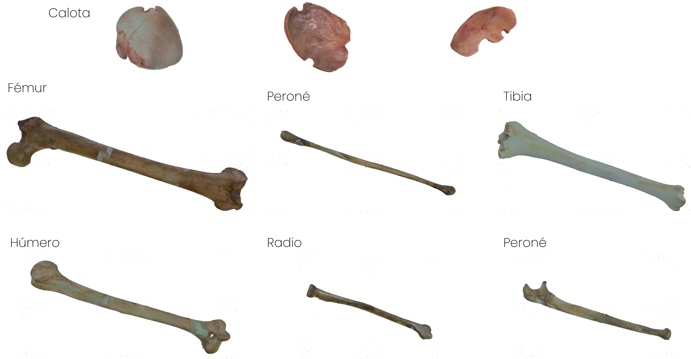
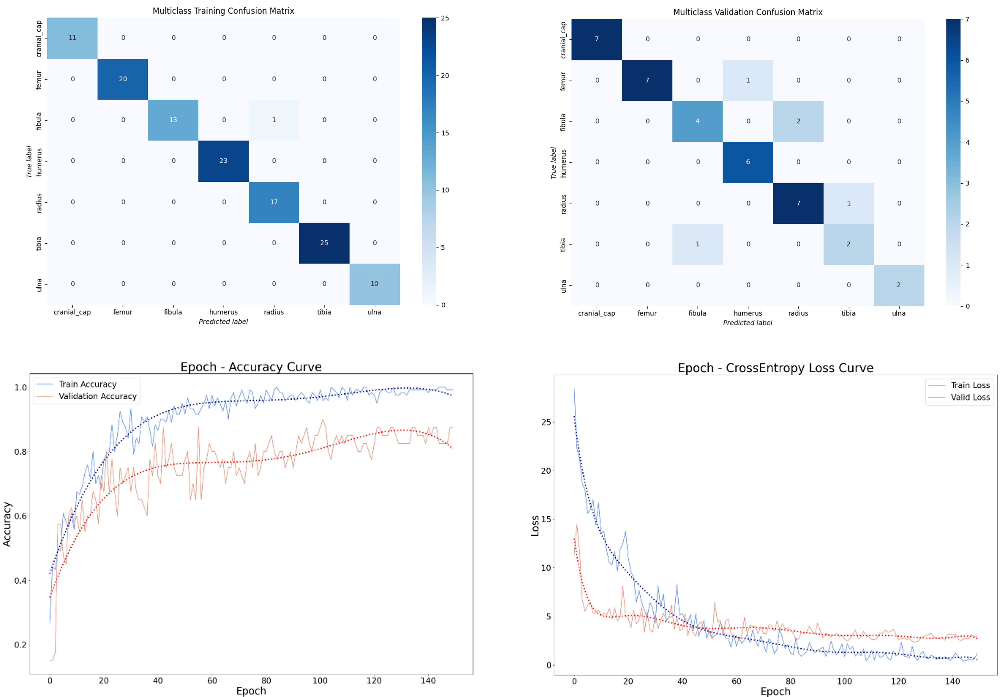
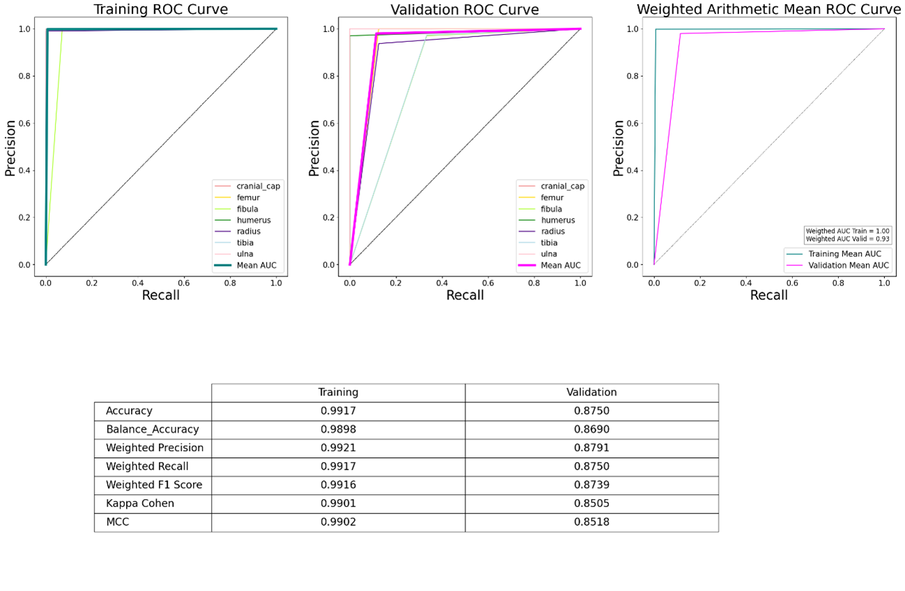
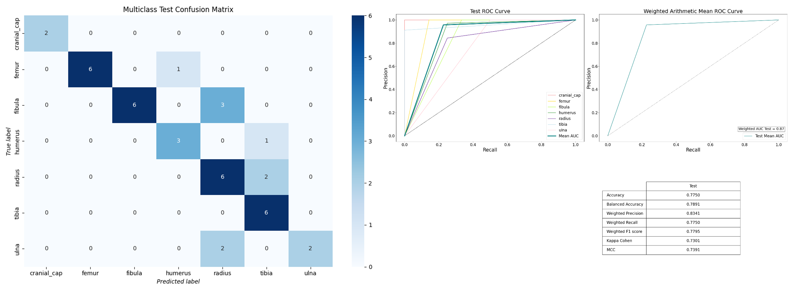

# Modified PointNet++ based on Pytorch

Este repositorio es la implementación de la red PointNet++ (http://papers.nips.cc/paper/7095-pointnet-deep-hierarchical-feature-learning-on-point-sets-in-a-metric-space.pdf) en Pytorch para el Trabajo de Fin de Master - UPV "Desarrollo de un clasificador de modelos óseos con inteligencia artificial mediante PointNet++ y escaneado 3D para el primer banco virtual de Europa" desarrollado dentro del BTELab (Valencia)

En el proyecto del primer banco virtual de tejidos de Europa, en colaboración con el Banco de Células y Tejidos de la Comunidad Valenciana, se busca reducir la desestimación de muestras producida durante la selección de tejidos para implantación. Para ello, se emplea un escaneado 3D mediante luz estructurada, generando un modelo digital y obteniendo una base de datos de las muestras. Así se obtienen 200 muestras, principalmente de tejidos osteotécnicos donde no es necesario ambiente aséptico, facilitados por el Departamento de Anatomía y Embriología Humana de la Universidad de Valencia.



El conjunto de modelos digitalizados es procesado por una red neuronal basada en PointNet++, con particiones aleatorias del 60% para entrenamiento, 20% para validación y 20% para test. La red tiene diez hiperparámetros, optimizados en función del rendimiento y las métricas de exactitud, kappa de Cohen y coeficiente de correlación de Matthews. 

Para realizar el entrenamiento de la red se realiza desde terminal:

Primeramente es necesario instalar los requirements en el entorno, para ello:

```shell
pip install -r requirements_pointnet2.txt
```

Una vez instalados y con la base de datos empleada se generan los archivos de texto necesarios para establecer las particiones de entrenamiento, validación y test

```shell
python FilelisGen.py --folder [object folder]
```

A continuación se realiza el entrenamiento de la red:
```shell
python train_classification.py --batch_size 8 --model pointnet2_cls_mrg --num_category 7 --epoch 150 --learning_rate 1e-3 --num_point 10000 --optimizer Adam --log_dir [log dir]--decay_rate 1e-4 --use_normals --process_data --use_uniform_sample --folder [object folder]
```

Una vez finalizado el entrenamiento de la red, se obtienen los outputs de la red:
```shell
python plot_training_metrics.py --log_dir [log dir] --folder [object folder]
```

Si las métricas son las esperadas, se realiza el test de la red y la obtención de los outputs:
```shell
## Test
python test_classification.py --batch_size 8 --num_category 7 --num_point 10000 --log_dir [log dir]--use_normals --use_uniform_sample --folder [object folder]
## Obtención de los outputs
python plot_test_metrics.py --log_dir [log dir] --folder [object folder]
```


El modelo final presenta una exactitud de 0.9917 en entrenamiento, 0.8750 en validación y 0.7750 en test. Estos resultados son satisfactorios, de forma que más del 70% de las nuevas muestras serán identificadas correctamente de forma automática, para una futura implementación dentro del proyecto.




